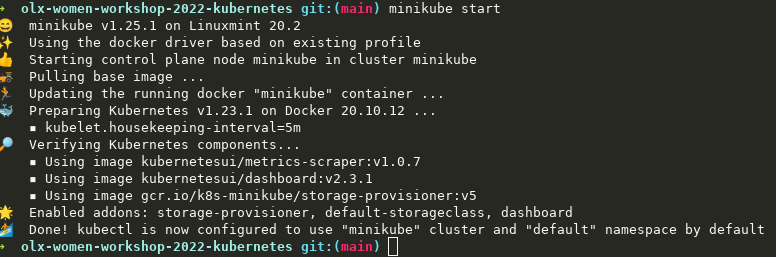
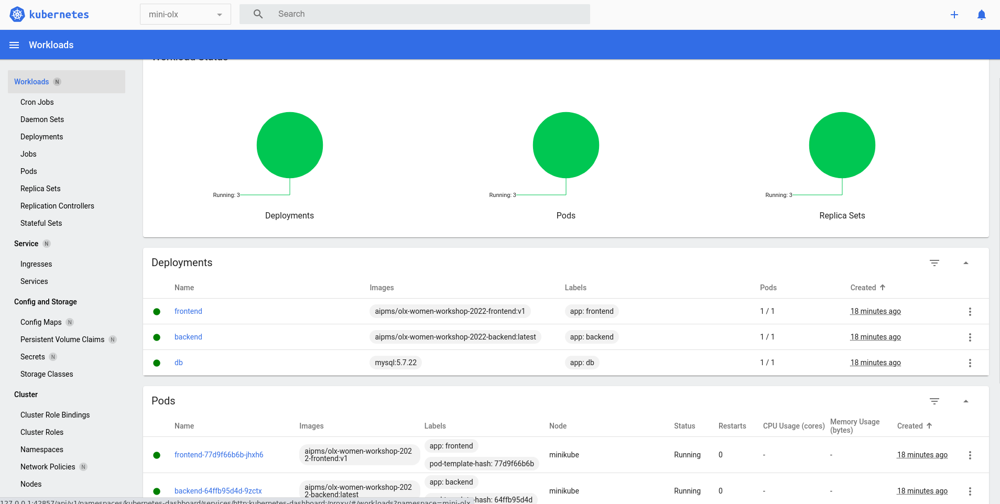
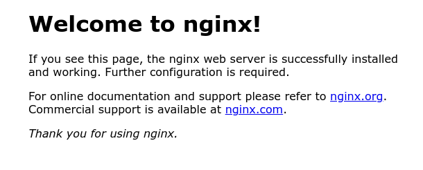
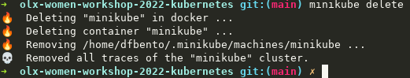

# OLX Women Workshop - Kubernetes

# Requirements
- Docker (Desktop for Mac/Windows, Engine for Linux) - https://www.docker.com/get-started
- MiniKube - https://minikube.sigs.k8s.io/docs/start/
- kubectl - https://kubernetes.io/docs/tasks/tools/
- VS Code IDE - https://code.visualstudio.com with the following extensions:
  - Docker - https://marketplace.visualstudio.com/items?itemName=ms-azuretools.vscode-docker
  - Kubernetes - https://marketplace.visualstudio.com/items?itemName=ms-kubernetes-tools.vscode-kubernetes-tools

# Instructions
## 1. Working with minikube

First of all we will start minikube to setup our cluster with only one Node.

> minikube quickly sets up a local Kubernetes cluster on macOS, Linux, and Windows. We proudly focus on helping application developers and new Kubernetes users.

Open your terminal and type (it should show something similar to the image)

```sh
$ minikube start --driver=docker --ports=30080:30080
```



### Minikube dashboard

```sh
minikube dashboard
```

In the end of the workshop, if you run this command you should get something like this



## 2. Create project for the application

1. Open your terminal again and change for a directory of your choise.
2. Create a directory called `mini-olx-kubernetes` to place all Kubernetes Resources. And then, get inside it.

```
mkdir mini-olx-kubernetes

cd mini-olx-kubernetes
```

## 3. Deploying your First nginx Pod

So, let's create our first deployment to boot a Pod with nginx! You can create a file called nginx.yaml inside the projet directory with the following contents.


```yaml
apiVersion: v1
kind: Pod
metadata:
  name: webserver           # name of the resource
  labels:
    app: frontend
    env: production
spec:
  containers:
    - name: webserver       # name of the container
      image: nginx:latest   # image to be downloaded
      ports:
      - containerPort: 80   # nginx is running on port 80
        name: http
      resources:
            requests:
              memory: "1Gi" # request 1Gi memory 
              cpu: "250m"   # request 250 milicores
            limits:
              memory: "1Gi" # limit memory to 1Gi
              cpu: "500m"   # limit CPU to 500 milicores
 ```

With this configuration, it will create a pod named **webserver** and it is getting the lastest nginx image which is on [Docker Hub](https://hub.docker.com/). And it will **request 1Gb of memory and 250 milicores**. The limits can go to **500 milicores, but still, 1Gb of memory**.

Now, let's apply this new resource into our minikube kubernetes cluster.

```sh
$ kubectl apply -f nginx.yaml
pod/webserver created
```

Now the pod is created, it's possible to see the status **Creating** and after the image is ready, if everything went well, it will show **Running**. Depending on your Internet connection it can take a little more time pulling the image from Docker Hub.

You can get a list of the running pods.

```sh
$ kubectl get pods
NAME        READY   STATUS    RESTARTS   AGE
webserver   1/1     Running   0          2m17s
```

Now, lets see a little more information around the current pods available.

```sh
$ kubectl get pods -o wide
NAME        READY   STATUS    RESTARTS   AGE    IP           NODE       NOMINATED NODE   READINESS GATES
webserver   1/1     Running   0          111s   172.17.0.3   minikube   <none>           <none>
```

It's possible to see a complete description of a particular pod. In this case, let's describe our **webserver** pod (po is a shortname for pod)

```sh
$ kubectl describe po webserver
Name:         webserver
Namespace:    default
Priority:     0
Node:         minikube/192.168.49.2
Start Time:   Sun, 10 Apr 2022 19:18:56 +0100
Labels:       env=production
Annotations:  <none>
Status:       Running
IP:           172.17.0.3
IPs:
  IP:  172.17.0.3
Containers:
  webserver:
    Container ID:   docker://72f10e58f2a7be06f318bfb49b0db1218e0ee8cba52e9593e97802ac11f9606d
    Image:          nginx:latest
    Image ID:       docker-pullable://nginx@sha256:2275af0f20d71b293916f1958f8497f987b8d8fd8113df54635f2a5915002bf1
    Port:           80/TCP
    Host Port:      0/TCP
    State:          Running
      Started:      Sun, 10 Apr 2022 19:19:03 +0100
    Ready:          True
    Restart Count:  0
    Limits:
      cpu:     500m
      memory:  1Gi
    Requests:
      cpu:        250m
      memory:     1Gi
    Environment:  <none>
    Mounts:
      /var/run/secrets/kubernetes.io/serviceaccount from kube-api-access-rthrc (ro)
Conditions:
  Type              Status
  Initialized       True
  Ready             True
  ContainersReady   True
  PodScheduled      True
Volumes:
  kube-api-access-rthrc:
    Type:                    Projected (a volume that contains injected data from multiple sources)
    TokenExpirationSeconds:  3607
    ConfigMapName:           kube-root-ca.crt
    ConfigMapOptional:       <nil>
    DownwardAPI:             true
QoS Class:                   Burstable
Node-Selectors:              <none>
Tolerations:                 node.kubernetes.io/not-ready:NoExecute op=Exists for 300s
                             node.kubernetes.io/unreachable:NoExecute op=Exists for 300s
Events:
  Type    Reason     Age    From               Message
  ----    ------     ----   ----               -------
  Normal  Scheduled  3m11s  default-scheduler  Successfully assigned default/webserver to minikube
  Normal  Pulling    3m11s  kubelet            Pulling image "nginx:latest"
  Normal  Pulled     3m4s   kubelet            Successfully pulled image "nginx:latest" in 6.766627343s
  Normal  Created    3m4s   kubelet            Created container webserver
  Normal  Started    3m4s   kubelet            Started container webserve
```

**Executing commands inside Pods**

It's possible to execute commands inside a give pod, for that you should use the `exec` command (similar to docker)

```sh
$ kubectl exec -it webserver -- /bin/bash
root@webserver:/#
```

But for instance, at this moment **nginx** is running inside the cluster, but we don't have any access to it. How can we expose it?

Let's expose our webserver to accessible from outside (it will create a service of type **NodePort**)

```sh
$ kubectl expose pod webserver --type=NodePort --port=80 --overrides '{"apiVersion": "v1","spec":{"ports":[{"port":80,"protocol":"TCP","targetPort":80,"nodePort":30080}]}}'
service/webserver exposed
```

or creating the following file `nginx-service.yaml`

```yaml
apiVersion: v1
kind: Service
metadata:
  name: webserver
spec:
  type: NodePort
  selector:
    app: frontend
  ports:
  - protocol: TCP
    port: 80
    targetPort: 80
    nodePort: 30080
```
and execute

```sh
$ kubectl apply -f nginx-service.yaml
```

We can also describe more properties of the service associated with our webserver pod (svc is a shortname for service)

```sh
$ kubectl get svc webserver
NAME        TYPE       CLUSTER-IP      EXTERNAL-IP   PORT(S)        AGE
webserver   NodePort   10.102.248.84   <none>        80:30080/TCP   9s
```

Finally, but not least, we can get our current minikube IP Address. We will use it to access our nginx server on port 31697 which you can see on mapped PORT(S).

```sh
$ minikube ip
192.168.49.2
```

```sh
$ curl http://127.0.0.1:30080/
```
### For Linux users
```sh
$ curl http://192.168.49.2:30080/
```

Or you can use simply (it will automatically open the browser)

```sh
$ minikube service webserver
```

Now you can open your browser on the following address: `http://127.0.0.1:30080`.




**Deleting the Pod**

You can delete a given pod using the following command.

```sh
$ kubectl delete -f nginx.yaml
pod "webserver" deleted

$ kubectl get po -o wide
No resources found.
```

**So, let's start making our mini-olx cluster working!**

## 4. Creating mini-olx k8s structure

Before start, let's clean up our minikube cluster

```sh
$ minikube delete
```


And, again

```sh
$ minikube start --driver=docker --ports=31002:31002,31001:31001
```

Inside the directory you already created named `mini-olx-kubernetes`, create a directory named `k8s`, in the end of the workshop, your directory structure should be the following:

```sh
|--k8s
|  |--deployments
|  |--namespaces
|  |--services
|  |--volumes
| nginx.yaml
```

1. Open the terminal and change to `mini-olx-kubernetes` directory.
2. Create a directory where you will put all your `kubernetes` files. Then inside the `mini-olx-kubernetes`:

```sh
$ cd mini-olx-kubernetes
$ mkdir k8s
```

Now we will start mounting our applications inside the minikube's kubernetes cluster.

### 1. Create the mini-olx Namespace

Inside your `k8s` directory, create the directory `namespaces` with `$ mkdir k8s/namespaces`

Create the file `k8s/namespaces/mini-olx.yaml`
```yaml
apiVersion: v1
kind: Namespace
metadata:
    name: mini-olx
```

It's possible to see on the following resources that all of them are inside `mini-olx` namespace. This will isolate our `mini-olx` application from other resources in the cluster.

### 2. Create the mini-olx PersistenVolume and PersistentVolumeClaim

The `PersistentVolume` will allow the application to store persistent data inside the cluster (it will only be removed if you do `minikube delete`). So, let's create a local volume on our local storage device for both backend (to store the images) and database (to store database data).

The `PersistentVolumeClaim` which will allow a Pod the request physical storage.

Inside your `k8s` directory, create the directory `volumes` with `$ mkdir k8s/volumes`

**Backend Volume**

Create the file `k8s/volumes/backend-pv.yaml`
```yaml
apiVersion: v1
kind: PersistentVolume
metadata:
  name: backend-pv     # name of the volume (to access this resource, we use this name)
  namespace: mini-olx  # namespace
  labels:
    type: local        # local storage
spec:
  storageClassName: manual
  capacity:
    storage: 5Gi       # it allocate 5Gi memory in disk
  accessModes:
    - ReadWriteOnce
  hostPath:
    path: "/mnt/data"
```

Create the file `k8s/volumes/backend-pvc.yaml`
```yaml
apiVersion: v1
kind: PersistentVolumeClaim
metadata:
  name: backend-pv-claim # name of the persistent volume claim
  namespace: mini-olx    # namespace
spec:
  storageClassName: manual
  accessModes:
    - ReadWriteOnce      # allow read and write
  resources:
    requests:
      storage: 5Gi       # it will request 5Gi memory in disk
```

**Database Volume**

Create the file `k8s/volumes/mysql-pv.yaml`
```yaml
apiVersion: v1
kind: PersistentVolume
metadata:
  name: mysql-pv
  namespace: mini-olx
  labels:
    type: local
spec:
  storageClassName: manual
  capacity:
    storage: 5Gi
  accessModes:
    - ReadWriteOnce
  hostPath:
    path: "/mnt/data"
```

Create the file `k8s/volumes/mysql-pvc.yaml`
```yaml
apiVersion: v1
kind: PersistentVolumeClaim
metadata:
  name: mysql-pv-claim
  namespace: mini-olx
spec:
  storageClassName: manual
  accessModes:
    - ReadWriteOnce
  resources:
    requests:
      storage: 5Gi
```

### 3. Create mini-olx Service

The `Service` will expose the applications running inside the Pods as a network service.

Inside your `k8s` directory, create the directory `volumes` with `$ mkdir k8s/services`

**Frontend Service**

Create the file `k8s/services/frontend.yaml`
```yaml
apiVersion: v1
kind: Service
metadata:
  name: frontend               # name of the resource
  labels:
    app: frontend
  namespace: mini-olx          # namespace
spec:
  type: NodePort               # let's expose our service into the outside network
  ports:
    - name: frontend-service   # name of the service
      protocol: TCP            # protocol (Default TCP)
      port: 80                 # the service will be served on port 80
      targetPort: 3000         # the pod is listening on port 3000
      nodePort: 31001          # the exposed port to outside will the 31001 (31001 will connect to 80 which will connect to 3000)
  selector:
    app: frontend
```

**Backend Service**

Create the file `k8s/services/backend.yaml`
```yaml
apiVersion: v1
kind: Service
metadata:
  name: backend
  labels:
    app: backend
  namespace: mini-olx
spec:
  type: NodePort
  ports:
    - name: backend-service
      protocol: TCP
      port: 4040
      targetPort: 4040
      nodePort: 31002
  selector:
    app: backend
```

**Database Service**

Create the file `k8s/services/db.yaml`
```yaml
apiVersion: v1
kind: Service
metadata:
  name: db
  labels:
    app: db
  namespace: mini-olx
spec:
  type: ClusterIP         # let's expose our service inside the cluster only
  ports:
    - name: db-service
      port: 33061         # it will expose por 33601 targeting to mysql port 3306
      targetPort: 3306
  selector:
    app: db
```

### 4. Create mini-olx Deployment

The `Deployment` is how we declare our Pods and ReplicaSets. 

Inside your `k8s` directory, create the directory `volumes` with `$ mkdir k8s/deployments`

**Database Deployment**

Create the file `k8s/deployments/db.yaml`
```yaml
apiVersion: apps/v1
kind: Deployment
metadata:
  name: db                                   # name of the resource
  labels:
    app: db
  namespace: mini-olx                        # namespace
spec:
  replicas: 1                                # we only want 1 replica running
  selector:
    matchLabels:
      app: db
  template:
    metadata:
      labels:
        app: db
    spec:
      containers:
        - name: mysql
          image: mysql:5.7.22
          resources:
            requests:
              memory: "1Gi"
              cpu: "250m"
            limits:
              memory: "1Gi"
              cpu: "500m"
          env:
            - name: MYSQL_ROOT_PASSWORD
              value: ""
            - name: MYSQL_ALLOW_EMPTY_PASSWORD
              value: "1"
          ports:
            - containerPort: 3306
              name: mysql
          volumeMounts:
            - name: mysql-persistent-storage    # use our persistent volume
              mountPath: /var/lib/mysql
      volumes:
        - name: mysql-persistent-storage        # use the persistent volume claim
          persistentVolumeClaim:
            claimName: mysql-pv-claim
```

**Frontend Deployment**

Create the file `k8s/deployments/frontend.yaml`
```yaml
apiVersion: apps/v1
kind: Deployment
metadata:
  name: frontend
  labels:
    app: frontend
  namespace: mini-olx
spec:
  replicas: 1
  selector:
    matchLabels:
      app: frontend
  template:
    metadata:
      labels:
        app: frontend
    spec:
      containers:
        - name: frontend
          image: aipms/olx-women-workshop-2022-frontend:v1
          resources:
            requests:
              memory: "1Gi"
              cpu: "250m"
            limits:
              memory: "1Gi"
              cpu: "500m"
          ports:
            - containerPort: 3000
              name: frontend
          env:
            - name: REACT_APP_API_BASE
              value: http://127.0.0.1:31002
```
**Backend Deployment**

Create the file `k8s/deployments/backend.yaml`
```yaml
apiVersion: apps/v1
kind: Deployment
metadata:
  name: backend
  labels:
    app: backend
  namespace: mini-olx
spec:
  replicas: 1
  selector:
    matchLabels:
      app: backend
  template:
    metadata:
      labels:
        app: backend
    spec:
      containers:
        - name: backend
          image: aipms/olx-women-workshop-2022-backend:latest
          imagePullPolicy: Always
          resources:
            requests:
              memory: "1Gi"
              cpu: "250m"
            limits:
              memory: "1Gi"
              cpu: "500m"
          ports:
            - containerPort: 4040
              name: backend
          env: 
            - name: DB_HOST
              value: db
            - name: DB_USER
              value: root
            - name: DB_PASS
              value: ""
            - name: DB_NAME
              value: mini_olx
            - name: IMAGE_PATH
              value: http://127.0.0.1:31002
          volumeMounts:
            - name: backend-persistent-storage
              mountPath: static/images
      volumes:
        - name: backend-persistent-storage
          persistentVolumeClaim:
            claimName: backend-pv-claim
```

### 5. Applying all the Kubernetes Resources

As all resources are created under the `mini-olx` namespace you shoud create it first.

```sh
$ kubectl apply -f k8s/namespaces/mini-olx.yaml
```

Now we can go for the other resources, starting with volumes.

```sh
$ kubectl apply -f k8s/volumes/backend-pv.yaml
$ kubectl apply -f k8s/volumes/backend-pvc.yaml
$ kubectl apply -f k8s/volumes/mysql-pv.yaml
$ kubectl apply -f k8s/volumes/mysql-pvc.yaml
```

Going to deployments.

```sh
$ kubectl apply -f k8s/deployments/db.yaml
$ kubectl apply -f k8s/deployments/backend.yaml
$ kubectl apply -f k8s/deployments/frontend.yaml
```

And finally, the services.

```sh
$ kubectl apply -f k8s/services/db.yaml
$ kubectl apply -f k8s/services/backend.yaml
$ kubectl apply -f k8s/services/frontend.yaml
```

For instance, it's necessary to bootstrap the dabase `mini_olx` on the database service. For that we can follow the next steps.

```sh
$ kubectl get pods -n mini-olx
$ kubectl exec -ti db-<hash> -n mini-olx -- /bin/sh
```

And then call `mysql` inside the pod

```sh
root@db-<hash>$ mysql
```

And inside MySQL run the following script:

```sql
CREATE DATABASE mini_olx;

USE mini_olx;

CREATE TABLE advert (
    id INT AUTO_INCREMENT PRIMARY KEY,
    title VARCHAR(150) NOT NULL,
    description text NOT NULL,
    price FLOAT not null,
    image_path VARCHAR(255) not null
);
```

### If you are a **Linux** you should follow the next steps

Frontend and Backend services are both configured with **NodePort**, so we can get the url to access them.

Check now the url of the frontend service.

```sh
$ minikube service frontend --url -n mini-olx
```

And now the url of the backend service

```sh
$ minikube service backend --url -n mini-olx
```

For instance, there are two variables on the frontend deployment and on the backend deployment which maybe should be adapted to the result of the previous command.

In the case of the frontend deployment, you should replace the value of the following environment variable by the backend url.
```yaml
env:
  - name: REACT_APP_API_BASE
    value: http://192.168.49.2:31002
```

In the case of the backend deployment, you should replace the value of the following environment variable by the backend url.
```yaml
env:
  - name: IMAGE_PATH
    value: http://192.168.49.2:31002
```

If you changed them, you can rerun:

```sh
$ kubectl delete -f k8s/deployments/frontend.yaml
$ kubectl delete -f k8s/deployments/backend.yaml
$ kubectl apply -f k8s/deployments/frontend.yaml
$ kubectl apply -f k8s/deployments/backend.yaml
```


## Finally!

Go to your favorite browser and _open the frontend url_! It's possible that at the first request it takes a while. 🚀

You should be able to play with the backend's API without using the frontend.

```sh
$ curl -X GET|POST|DELETE http://127.0.0.1:31002/api/ads?... # check references for more details
```

For **Linux** users

```sh
$ curl -X GET|POST|DELETE http://192.168.49.2:31002/api/ads?... # check references for more details
```

### Dashboard

Now, we can take a look again on our minikube dashboard

```sh
minikube dashboard
```

You can check if there is any problem using the logs command.

```sh
$ kubectl get pods -n mini-olx

$ kubectl logs <podname> -n mini-olx
```

## Next Steps

After instantiate all the mini-olx cluster you start playing around with scale up/down. Having more pods for frontend/backend to ensure resilience. 

And get ready for the next workshop, where you will put all this infrastructure on AWS and have it publically accessible!

Cya! 👋